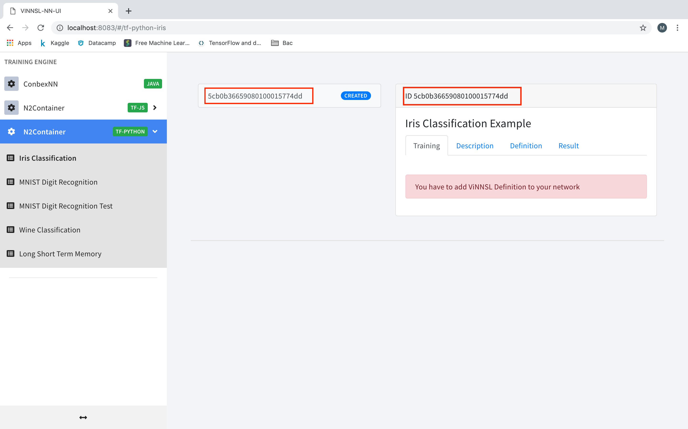

# N2Container  
Is an extension of Container Based Execution Stack for Neural Networks (ConbexNN). 
This project features web services to train and evaluate neural networks using the Kubernetes container orchestration with Java, TensorFlow and TensorFlow Node.js based microservice architecture. 
<!---
## Demo VM
See the project in Action by running a virtual machine. It comes preconfigured with Kubernetes running all necessary ConbexNN services and a neural network training set for testing.

<!---

<!---You can try out the RESTful API and GUI.

<!---* See [instructions here](/deploy/vm/) --->

## Setup 

### Local

#### Setup on local machine with Docker Edge

Preferred if you have a Docker hypervisor compatible machine

You can setup and run this project with Docker Edge and Kubernetes enabled
See [instructions here](/deploy/local_dockerce/)

#### Setup on local machine with Minikube

You can setup and run this project with the Minikube VM
See [instructions here](/deploy/local_minikube/)

<!---
### Cloud. - has not been set up yet -

#### Setup in Google Cloud

You can setup and run this project in Google Kubernetes Engine.
See [instructions here](/deploy/cloud/google/)

#### Setup in Microsoft Azure

You can setup and run this project in Microsoft Azure Kubernetes Service.
See [instructions here](/deploy/cloud/azure/)

#### Setup in Amazon EKS

You can setup and run this project in Microsoft EKS
This could not be tested, as billing must be enabled and EKS is not included in the AWS student program. Read the [amazon Documentation](https://docs.aws.amazon.com/eks/latest/userguide/getting-started.html) on how to deploy Kubernetes Clusters.
--->

## Usage

To Create a new Neural Network you have to send the vinnsl data to the vinnsl-service container.
You can use Postman to send the requests. https://www.getpostman.com

1. You need to send a post reqest to localhost:8080/vinnsl with the description of the neural network. Copy our vinnsl-description into the body section of the request.

2. Now you can see that a new neural network was created

3. Copy the id of the neural network and send a put request with the vinnsl definition to: localhost/vinnsl/id/definition
(Please replace id with the id of your neural network as shown in the picture)

  
4. Now you can start the training

