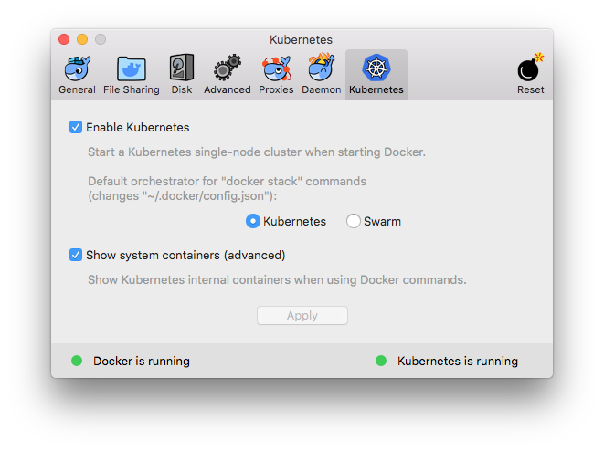
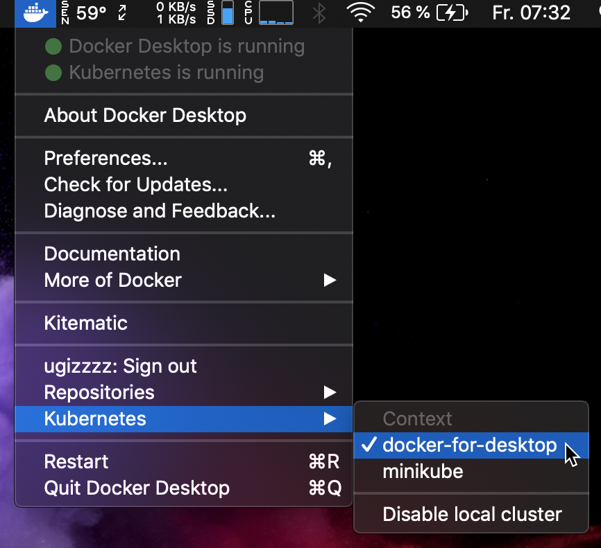
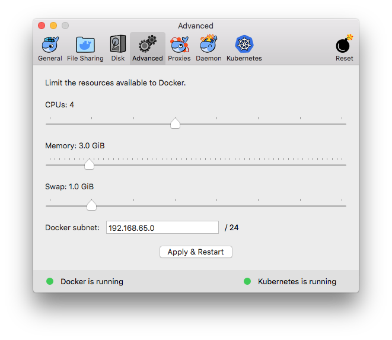
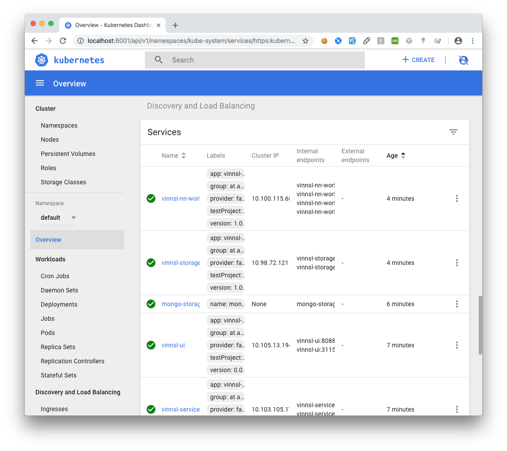

# Setting up on local machine with Docker CE

## Prerequisites

- Docker Edge (Kubernetes enabled)

- Enabled docker-for-desktop 

- Allow Docker to allocate to 3GB memory or higher

   

- kubectl installed (https://kubernetes.io/docs/tasks/tools/install-kubectl/#install-kubectl)

- Port 80 and 443 must be free to use, no other services should be running on these ports

## Set up

### Setup Services

cd into folder /deploy/local_dockerce/yaml

```bash
kubectl apply -f mongo_small.yaml
kubectl apply -f vinnsl-service.yaml
kubectl apply -f vinnsl-nn-ui.yaml
kubectl apply -f mongo-storage-service.yaml
kubectl apply -f vinnsl-storage-service.yaml
kubectl apply -f vinnsl-nn-worker.yaml
kubectl apply -f vinnsl-nn-worker-python.yaml
kubectl apply -f vinnsl-nn-worker-js.yaml
```

### Check if Services are up

#### Enable Kubernetes Dashboard

```
kubectl apply -f https://raw.githubusercontent.com/kubernetes/dashboard/v1.10.1/src/deploy/recommended/kubernetes-dashboard.yaml

```

#### Open Dashboard

```
kubectl proxy
```

Open in Browser: http://localhost:8001/api/v1/namespaces/kube-system/services/https:kubernetes-dashboard:/proxy/#!/overview?namespace=default

#### Check Services

All Services should be deployed and ready



### Enable Service Discovery with Ingress

#### Enable Ingress for DockerCE

```bash
kubectl apply -f https://raw.githubusercontent.com/kubernetes/ingress-nginx/master/deploy/mandatory.yaml

kubectl apply -f https://raw.githubusercontent.com/kubernetes/ingress-nginx/master/deploy/provider/cloud-generic.yaml
```

#### Configure Ingress

```
kubectl apply -f ingress.yaml
```

After a few minutes 

```
kubectl get ing
```

should return

```
NAME              HOSTS     ADDRESS     PORTS     AGE
cluster-ingress   *         localhost   80        2m
```

## Usage

```
kubectl get pods
```
<!---
It should return something like this:

--->

The following commands will enable you to call the services. 
- Please notice that you will get different numbers after the names, so copy your own names.
- Please execute each command in a new tab and keep it open
```
kubectl port-forward vinnsl-nn-ui-deploy-6584cf995-xpmtr 8083:8083
kubectl port-forward vinnsl-service-759d4587bb-mpb4h 8080:8080
kubectl port-forward vinnsl-storage-service-56ff7ddddf-994l9 8081:8081
kubectl port-forward vinnsl-nn-worker-7dfd5bb6f4-55h4s 8084:8084
kubectl port-forward vinnsl-nn-worker-python-576fbbf685-ttk58 4000:4000
kubectl port-forward vinnsl-nn-worker-tensorflow-js-55b95f7494-69zq8 3000:3000
```

You can now open your browser: http://localhost:8083/ and should see the Vinnsl-NN-UI

 
