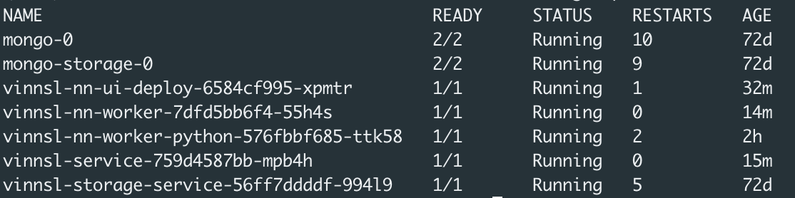

# Setting up on local machine with minikube
## Prerequisites

- minikube installed (https://github.com/kubernetes/minikube/releases)
- kubectl installed (https://kubernetes.io/docs/tasks/tools/install-kubectl/#install-kubectl)

## Set up

### Start Cluster

```
minikube start
```

### Check status

```
minikube status
```

Should return 

```
minikube: Running
cluster: Running
kubectl: Correctly Configured: pointing to minikube-vm at 192.168.99.102
```

Services can be reached at this ip address after successful deployment

### Setup Services

cd into folder /deploy/local_minikube/yaml

```bash
kubectl apply -f mongo_small.yaml
kubectl apply -f vinnsl-service.yaml
kubectl apply -f vinnsl-nn-ui.yaml
kubectl apply -f mongo-storage-service.yaml
kubectl apply -f vinnsl-storage-service.yaml
kubectl apply -f vinnsl-nn-worker.yaml
kubectl apply -f vinnsl-nn-worker-python.yaml
kubectl apply -f vinnsl-nn-worker-js.yaml
```

### Enable Service Discovery with Ingress

```
kubectl apply -f ingress.yaml
```

### Check status with Dashboard

```
minikube dashboard
```

This commands opens the dashboard and lets you check the status of the services. This can take a few minutes.

## Usage

```
kubectl get pods
```
It should return something like this:


The following commands will enable you to call the services. 
- Please notice that you will get different numbers after the names, so copy your own names.
- Please execute each command in a new tab and keep it open
```
kubectl port-forward vinnsl-nn-ui-deploy-6bcb4fc9c6-6l6tf 8083:8083
kubectl port-forward vinnsl-nn-worker-7dfd5bb6f4-55h4s 8084:8084
kubectl port-forward vinnsl-nn-worker-python-576fbbf685-ttk58 4000:4000
kubectl port-forward vinnsl-nn-worker-tensorflow-js-75859cbd5d-n45l5 3000:3000
kubectl port-forward vinnsl-service-56968789c7-6vg8t 8080:8080
kubectl port-forward vinnsl-storage-service-56ff7ddddf-994l9 8081:8081
```

You can now open your browser: https://localhost:8083/ and should see the Vinnsl-NN-UI


