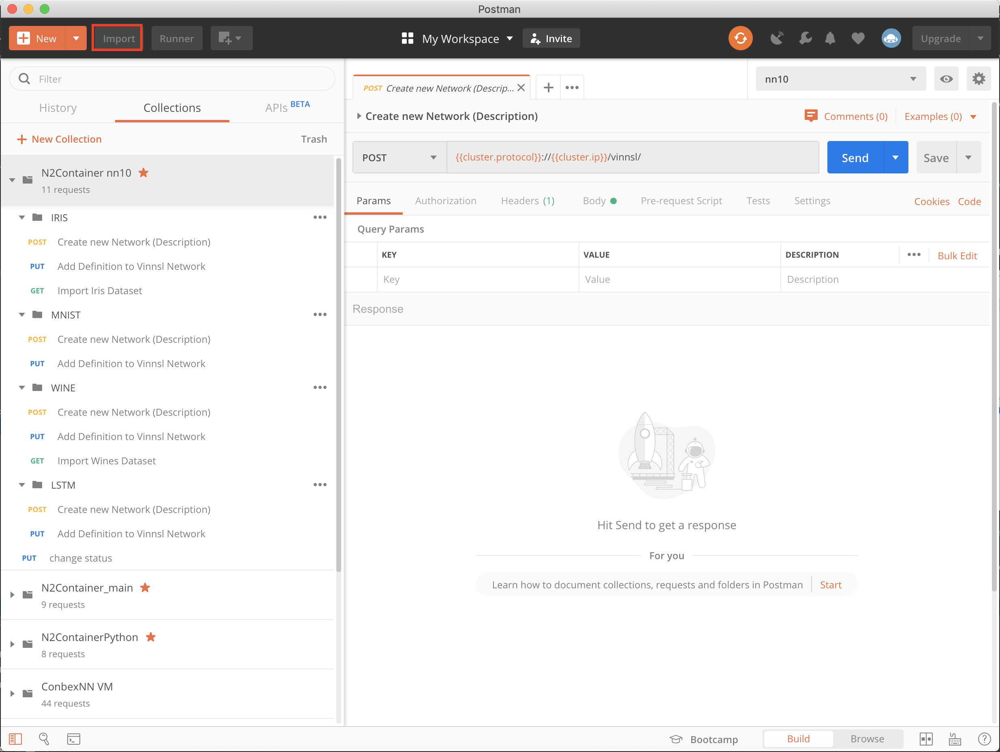
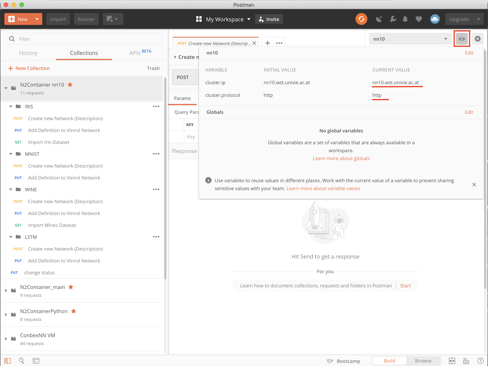
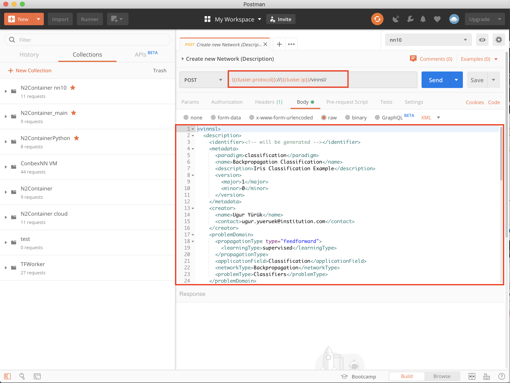
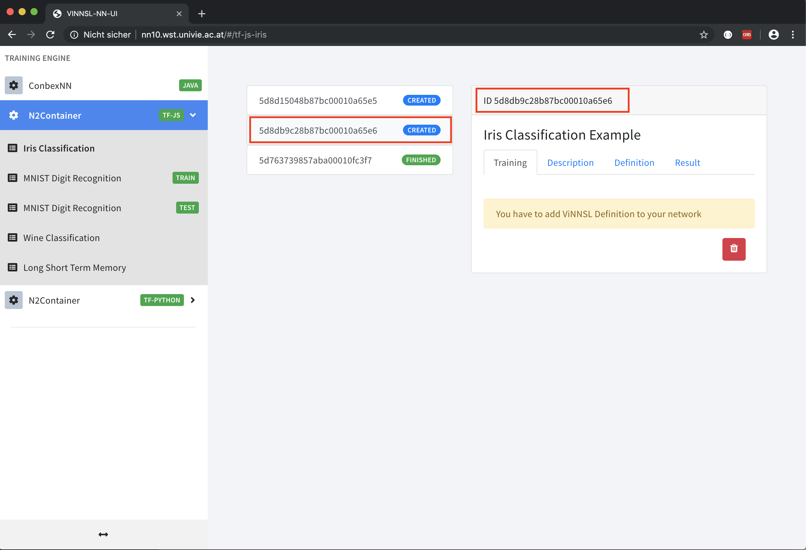
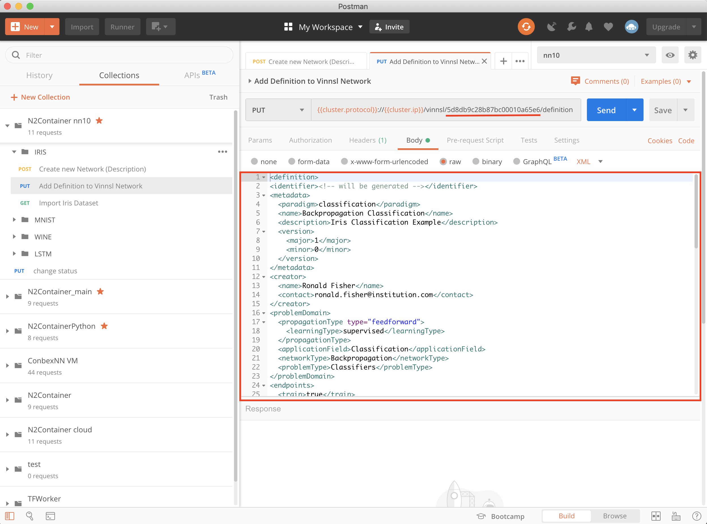
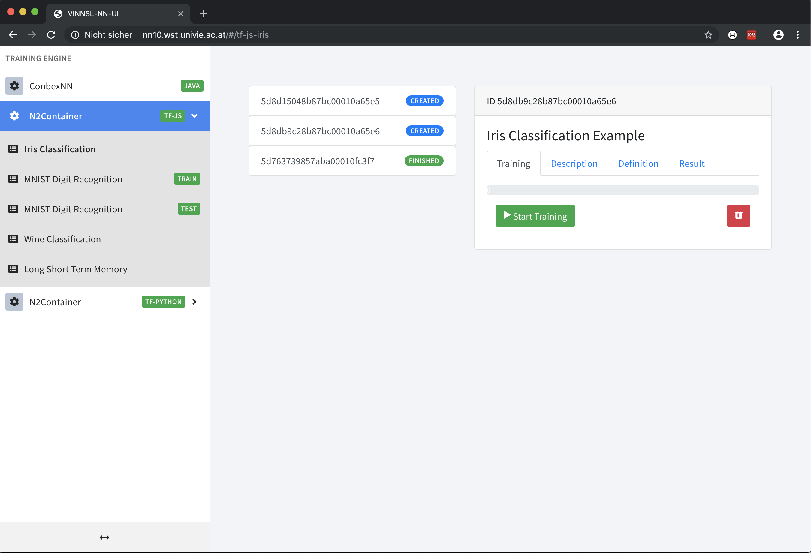

## Usage

To Create a new Neural Network you have to send the vinnsl data to the vinnsl-service container.
You can use Postman to send the requests. https://www.getpostman.com

###
You have to import vinnsl collection into postman. See [vinnsl postman collection](/vinnsl-postman-usage-production/collections)
1. Import collection 

   Choose vinnsl collection from [vinnsl-postman-collection folder](/vinnsl-postman-usage-production/collections)

2. Choose a correct environment 
If no variable setup, click on edit and create enviroment variable

3. You need to send a post request to {{cluster.protocol}}://{{cluster.ip}}/vinnsl/ with the description of the neural network. Copy our vinnsl-description into the body section of the request.

4. Now you can see that a new neural network was created

5. Copy the id of the neural network and send a put request with the vinnsl definition to: {{cluster.protocol}}://{{cluster.ip}}/vinnsl/id/definition
(Please replace id with the id of your neural network as shown in the picture)

  
6. Now you can start the training

